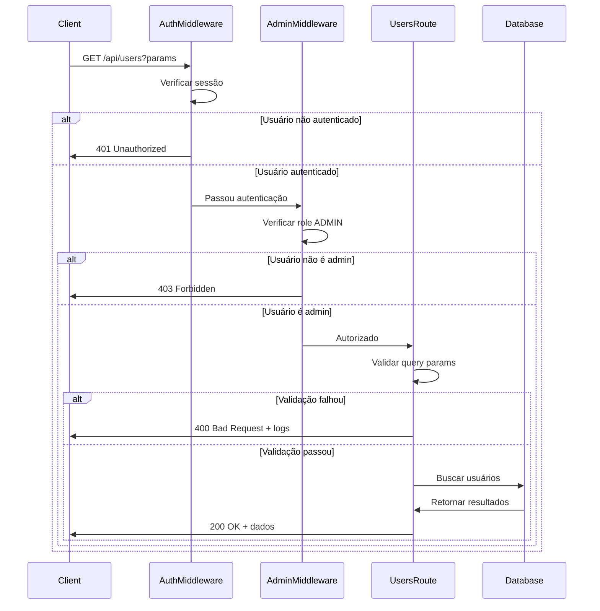
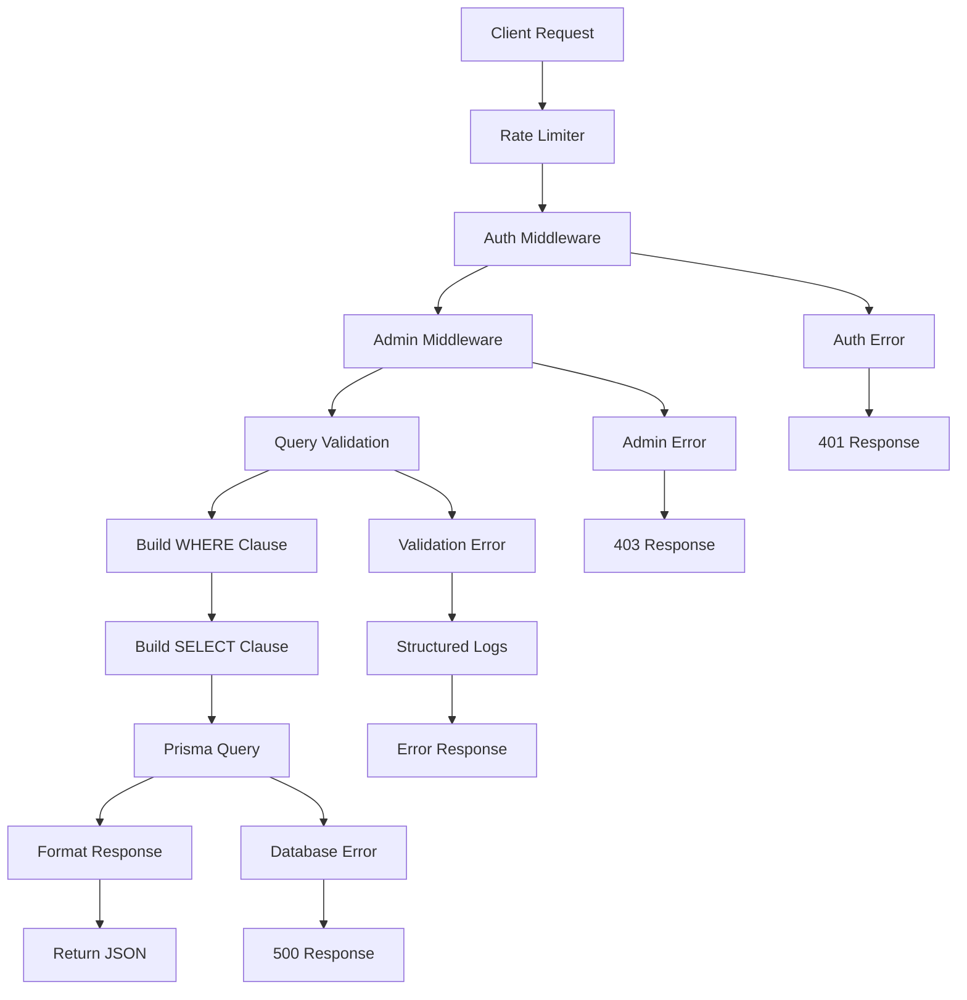

# Rota de Listagem de Usuários para Administradores

## Overview

Esta funcionalidade implementa uma rota API REST exclusiva para administradores que permite listar usuários do sistema com suporte a paginação, filtros de busca e seleção customizada de campos. A rota segue os padrões de segurança estabelecidos no projeto, utilizando middlewares de autenticação e autorização de administrador.

**Objetivo Principal**: Fornecer aos administradores uma interface para visualizar e gerenciar usuários cadastrados no sistema.

**Características Principais**:

- Acesso restrito apenas a usuários com role ADMIN
- Paginação baseada em timestamp com cursor
- Filtros WHERE simples e seguros
- Seleção customizada de campos não-sensíveis
- Validação rigorosa de entrada usando Zod
- Logs estruturados para auditoria e debugging

## Backend Architecture

### API Endpoint Specification

#### GET /api/users

**Descrição**: Lista usuários do sistema com suporte a paginação e filtros.

**Autenticação**: Requerida (session-based via middleware)
**Autorização**: Apenas usuários com role ADMIN

**Query Parameters**:

```typescript
interface UsersListQuery {
  // Paginação
  lastItemTimestamp?: Date; // Cursor para paginação
  limit?: number; // Máximo de itens (padrão: 20, max: 100)

  // Filtros WHERE
  role?: "USER" | "ADMIN"; // Filtrar por role do usuário
  emailVerified?: boolean; // Filtrar por status de email verificado

  // Seleção de campos
  select?: string[]; // Campos a serem retornados
}
```

**Response Schema**:

```typescript
interface UsersListResponse {
  users: Array<{
    id: string;
    name?: string;
    email?: string;
    emailVerified?: boolean;
    role?: "USER" | "ADMIN";
    createdAt?: Date;
    updatedAt?: Date;
    image?: string;
  }>;
  pagination: {
    hasMore: boolean;
    nextCursor?: Date;
    total: number;
  };
}
```

### Schema Definitions

#### Validation Schemas

**Query Validation Schema**:

```typescript
const userListQuerySchema = z.object({
  // Paginação (reutilizando paginationSchema existente)
  lastItemTimestamp: z.coerce.date().optional(),
  limit: z.coerce.number().min(1).max(100).default(20),

  // Filtros WHERE
  role: z.enum(["USER", "ADMIN"]).optional(),
  emailVerified: z.coerce.boolean().optional(),

  // Seleção de campos (whitelist de campos seguros)
  select: z
    .array(
      z.enum([
        "id",
        "name",
        "email",
        "emailVerified",
        "role",
        "createdAt",
        "updatedAt",
        "image",
      ])
    )
    .optional(),
});
```

**Error Response Schema**:

```typescript
interface ErrorResponse {
  error: string;
  details?: string;
  validationErrors?: Array<{
    field: string;
    message: string;
    code: string;
  }>;
}
```

### Authentication & Authorization Flow



### Data Access Layer

**Prisma Query Builder**:

```typescript
// Construção dinâmica da query baseada nos filtros
const buildWhereClause = (filters: UserFilters) => {
  const where: Prisma.UserWhereInput = {};

  // Paginação por cursor
  if (filters.lastItemTimestamp) {
    where.createdAt = { gte: new Date(filters.lastItemTimestamp) };
  }

  // Filtros opcionais
  if (filters.role) where.role = filters.role;
  if (typeof filters.emailVerified === "boolean") {
    where.emailVerified = filters.emailVerified;
  }

  return where;
};

// Seleção de campos seguros
const buildSelectClause = (fields?: string[]) => {
  if (!fields || fields.length === 0) {
    return {
      id: true,
      name: true,
      email: true,
      emailVerified: true,
      role: true,
      createdAt: true,
      updatedAt: true,
      image: true,
    };
  }

  return fields.reduce(
    (select, field) => {
      select[field] = true;
      return select;
    },
    {} as Record<string, boolean>
  );
};
```

### Route Implementation Details

**Middleware Stack**:

1. `authMiddleware` - Validação de sessão
2. `adminMiddleware` - Verificação de privilégios de admin
3. `zValidator` - Validação de query parameters

**Error Handling Pattern**:

```typescript
// Seguindo o padrão de logs estruturados do projeto
if (!validationResult.success) {
  const validationErrors = validationResult.error.issues.map((issue) => ({
    field: issue.path.join(".") || "root",
    message: issue.message,
    code: issue.code,
  }));

  console.log("❌ Validation failed for users listing:");
  console.log("📝 Received query:", JSON.stringify(query, null, 2));
  console.log("🔍 Validation errors:", validationErrors);
  console.log("📋 Expected schema structure:", {
    role: "enum ['USER', 'ADMIN'] (optional)",
    emailVerified: "boolean (optional)",
    select: "array of allowed fields (optional)",
    lastItemTimestamp: "date for pagination (optional)",
    limit: "number 1-100 (default: 20)",
  });

  return c.json(
    {
      error: "Query validation failed",
      details: validationErrors
        .map((err) => `${err.field}: ${err.message}`)
        .join(", "),
      validationErrors,
    },
    400
  );
}
```

## Data Flow Architecture



### Security Considerations

**Campos Excluídos por Segurança**:

- `sessions` - Contém tokens de sessão
- `accounts` - Contém tokens OAuth e dados sensíveis
- `apiKey` - Dados de chaves de API (relacionamento omitido)

**Rate Limiting**:

- Utiliza o rate limiter global do Hono (100 req/min)
- Proteção contra abuso de endpoints administrativos

**Input Sanitization**:

- Validação rigorosa com Zod
- Whitelist de campos selecionáveis
- Sanitização de parâmetros de query

### Performance Optimization

**Database Indexing**:

```sql
-- Índices existentes que otimizam a query
CREATE INDEX idx_user_created_at ON user(createdAt);
CREATE INDEX idx_user_role ON user(role);
CREATE INDEX idx_user_email_verified ON user(emailVerified);
```

**Pagination Strategy**:

- Cursor-based pagination usando `createdAt`
- Limite máximo de 100 items por página
- Performance consistente independente do offset

## Route Registration

**Integração com Hono App**:

```typescript
// src/lib/hono/app.ts
import { usersRoute } from "@api/routes/users/users.route";

export const honoApp = new Hono()
  .basePath("/api")
  // ... middlewares existentes
  .route("/auth", authRoute)
  .route("/ai/stream", aiStreamRoute)
  .route("/users", usersRoute); // Nova rota registrada
```

**Path Final**: `GET /api/users`

## Testing Strategy

### Unit Testing Requirements

**Query Validation Tests**:

- Validação de parâmetros válidos e inválidos
- Teste de limites (min/max para limit)
- Validação de campos select com whitelist

**Authorization Tests**:

- Acesso negado para usuários não-admin
- Acesso permitido para usuários admin
- Middleware chain funcionando corretamente

**Database Query Tests**:

- Filtros WHERE funcionando corretamente
- Paginação com cursor
- Seleção de campos customizada

**Error Handling Tests**:

- Logs estruturados em caso de erro
- Responses de erro formatados corretamente
- Validação de schemas de erro

### Integration Testing

**End-to-End Flow**:

1. Login como admin
2. Fazer requisição para `/api/users`
3. Verificar estrutura da resposta
4. Testar paginação
5. Testar filtros
6. Testar seleção de campos

**Security Testing**:

- Tentativa de acesso sem autenticação
- Tentativa de acesso como usuário comum
- Tentativa de selecionar campos sensíveis
