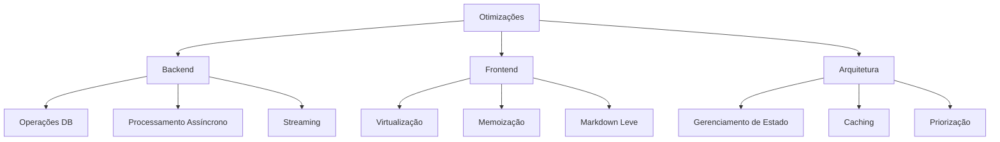

# Plano de Otimização para Performance do Chat

## Problemas Identificados

1. **Backend (API Route)**:
   - Operações de I/O excessivas no banco de dados (Prisma)
   - Geração de nome do chat via IA bloqueia o fluxo principal
   - Conversão serial de mensagens custosa
   - Salvamento de mensagens da IA durante streaming causa atrasos

2. **Frontend**:
   - Re-renders desnecessários em cascata (`MessagesContainer` → `ChatMessages` → `ChatBalloon`)
   - Ausência de virtualização na lista de mensagens
   - Processamento pesado de Markdown/Syntax Highlighting
   - Comparação ineficiente de mensagens com `JSON.stringify`
   - Efeitos colaterais mal otimizados (resize, scroll)

3. **Arquitetura**:
   - Duplicação de chamadas à API
   - Falta de memoização de componentes
   - Gerenciamento de estado subótimo

## Plano de Ação



### Backend (src/app/api/chat/route.ts)

1. **Otimizar Operações DB**:
   - Agrupar operações com transações do Prisma
   - Remover chamadas redundantes ao banco
   - Adicionar índices para consultas frequentes

2. **Processamento Assíncrono**:
   - Mover `generateChatNameWithAi` para fila (ex: BullMQ)
   - Usar nome temporário até geração completa

   ```ts
   // Exemplo de implementação
   import { Queue } from "bullmq";
   const namingQueue = new Queue("chat-naming");
   ```

3. **Streaming Eficiente**:
   - Enviar resposta imediatamente após primeiro chunk
   - Separar salvamento da mensagem IA do fluxo principal
   ```ts
   onTextChunk(chunk) {
     // Enviar chunk imediatamente
     // Salvar mensagem completa em worker separado
   }
   ```

### Frontend

1. **Virtualização de Lista** (src/component/ChatMessages/ChatMessages.tsx):
   - Implementar `react-virtuoso`
   - Renderizar apenas itens visíveis

   ```tsx
   import { Virtuoso } from "react-virtuoso";
   <Virtuoso data={messages} itemContent={renderBalloon} />;
   ```

2. **Memoização de Componentes**:
   - Adicionar `React.memo` em `ChatBalloon`
   - Usar `useCallback` para handlers

   ```tsx
   const MemoizedBalloon = React.memo(ChatBalloon);
   ```

3. **Otimizar Markdown** (src/component/ChatBalloon/ChatBalloon.tsx):
   - Substituir `react-markdown` por biblioteca mais leve
   - Carregar syntax highlighting apenas quando visível
   ```tsx
   import SimpleMarkdown from "simple-markdown";
   ```

### Melhorias Gerais

1. **Gerenciamento de Estado**:
   - Migrar para Zustand com seletores granulares

   ```ts
   const useMessages = create((set) => ({
     messages: [],
     addMessage: (msg) => set((state) => [...state.messages, msg]),
   }));
   ```

2. **Caching**:
   - Implementar `stale-while-revalidate` com React Query
   - Cache agressivo para mensagens

   ```tsx
   useQuery({
     queryKey: ["messages", chatId],
     staleTime: 60_000,
   });
   ```

3. **Priorização**:
   - Usar `isPending` para feedback imediato
   - Adicionar debounce para eventos de resize
   ```ts
   const handleResize = useDebouncedCallback(() => {...}, 300);
   ```

## Ordem de Implementação

1. Virtualização de lista (maior impacto na fluidez)
2. Memoização de componentes
3. Otimizações no backend
4. Melhorias de caching
5. Refatoração de Markdown

## Métricas de Sucesso

- Redução de 70% no tempo de resposta do chat
- Diminuição de 80% nos re-renders
- Eliminação de travamentos durante envio
